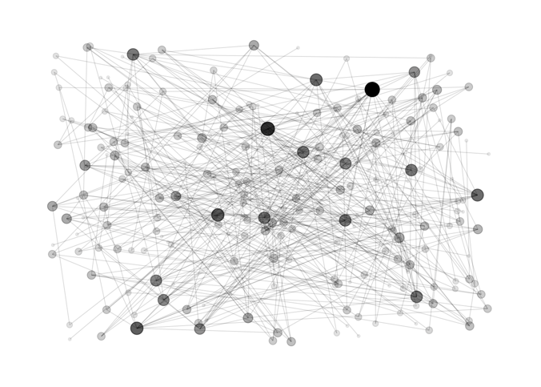
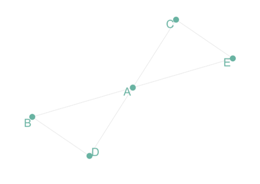
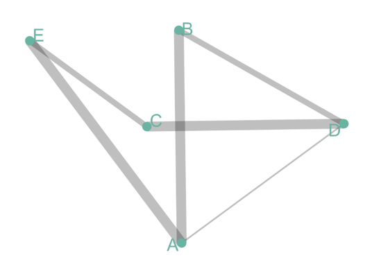
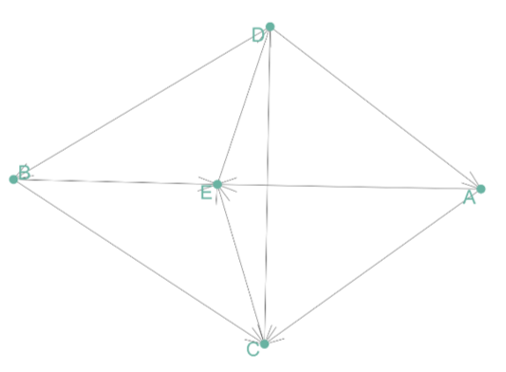
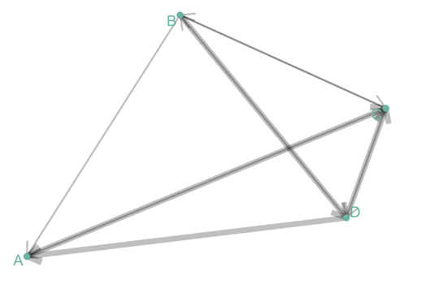
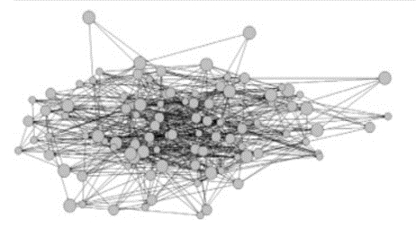

```{r setup, include=FALSE}
knitr::opts_chunk$set(echo = FALSE)
```

## Network Graph



## Social network analysis

"Health behaviors spread across social systems, crime is conducted through illicit networks, and community movements are prompted by social media. Social connections are crucial to each of these phenomena." (Robins, 2013)

## Graph Theory

Unweighted and Undirected Graph

Tom, Cherelle and Melanie live in the same house. They are connected but no direction and no weight

[](hyperlynk.to.somewhere)

<https://github.com/holtzy/Google-Scholar-Network> --------------------!!!!!!!

## Graph Theory

Undirected But Weighted

Co-authors are connected if they published a scientific paper together. The weight is the number of time it happened.



## Graph Theory

Directed But Unweighted

Tom follows Shirley on twitter, but the opposite is not necessarily true. The connection is unweighted, just connected or not.



## Graph Theory

Directed and Weighted

People migrate from a country to another: the weight is the number of people, the direction is the destination.



## Graph Theory Algorithm

## Research study example

A study of 102 undergraduate students in a university college. The nodes represent participants and the links between them are friendships. The size of each node reflects the strength of alcohol usage. A typical network-based research question would be whether alcohol usage is associated with friendship among these students. (Robins, 2013)



```{r echo=TRUE}

```

## References

Robins, G. (2013). A tutorial on methods for the modeling and analysis of social network data. Journal of Mathematical Psychology, 57(6), 261-274.

<https://github.com/holtzy/Google-Scholar-Network>
